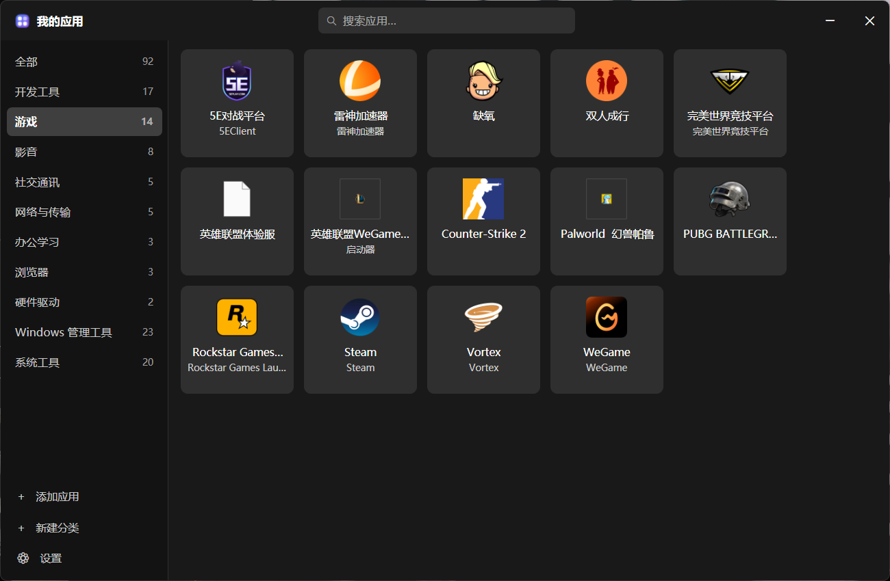

# WinLauncher 桌面应用启动器

[English](README.md) | **中文**

> 桌面上只留一个图标。点开，你要的软件都在，按用途分好了类。



Windows 有个习惯：桌面和开始菜单会被快捷方式填满，一个厂商一个文件夹，名字长这样——`Balena Ltd`、`CC Switch`、`Logi`。想找东西，得先读懂别人替你划的分类。

WinLauncher 把这些换成一个图标：一个自己会找你软件、按用途分好类、还能给每个软件写一句话说明的小面板。

---

## 它做什么

- **自己找软件。** 首次启动扫描开始菜单和桌面，把找到的程序归类。不用先选目录，不用维护清单。
- **按用途分类，不按厂商。** 固定十一个分类，不会因为多装一个软件就多出来一个。
- **一个软件可以同时属于多个分类。** PowerShell 既在「开发工具」也在「系统工具」。
- **每张卡片下面有一行简介** —— 可以改，也会自动从程序自带的信息里填一个起点。
- **什么都不会被删掉。** 把快捷方式移走，卡片变灰；移回来，简介和分类原样还在。

## 快速开始

构建需要 [.NET 10 SDK](https://dotnet.microsoft.com/download)。产物是单个自包含 exe，运行它的机器不需要装任何东西。

```powershell
git clone https://github.com/xiaoliumiaomiao/win-launcher.git
cd win-launcher
pwsh -File tools\install.ps1
```

会生成 `publish\WinLauncher.exe` 并在桌面建好快捷方式。

## 怎么用

| 做什么 | 得到什么 |
|---|---|
| 双击桌面图标 | 打开 |
| **Alt + .** | 在任何界面呼出 |
| `F5` | 重新扫描 |
| 把快捷方式拖进窗口 | 添加应用 |
| 右键卡片 → 编辑简介 | 写那行说明 |
| 右键卡片 → 归类 | 勾选它属于哪些分类 |
| 右键卡片 → 从列表中移除 | 从列表去掉（**不动磁盘上任何文件**）|
| 在搜索框输入 | 按名称、简介、路径过滤 |
| `✕` | 收进系统托盘，热键继续有效；退出走托盘菜单 |

界面和分类集都是中文的。分类器中英文关键词都认——有几个 Windows 自带工具只有靠英文名才认得出来。

## 分类是怎么做的

软件从两份开始菜单（当前用户 + 所有用户）和两个桌面发现，然后**按目标程序去重**，同一个程序只会出现一张卡片。

**分类不照搬开始菜单的文件夹名。** 那些是厂商目录名——`Balena Ltd`、`CodeBuddy CN`、`Logi`——照搬会得到 32 个"分类"，其中 18 个只装了一个应用。改成把每个应用对照十一个固定用途分类来匹配，依据是它的名字、所在的开始菜单文件夹、以及目标路径。

两个花了不少时间才做对的细节：

- **拉丁关键词按词边界匹配，中文和含符号的关键词按子串匹配。** 拉丁词用子串是个陷阱——关键词 `msi`（微星）会命中 `msinfo32.exe`，把「系统信息」分到硬件驱动里去。
- **噪声按目标过滤，不按名字。** 目标指向 `.html` / `.pdf` / `.txt` / `.chm` 的快捷方式是文档，不是应用。这一条就拦住了 `Git Release Notes`（指向 `releasenotes.html`）和 `Python Manuals`（指向 `doc\html\index.html`）——靠调关键词怎么都捞不干净。名字另外还会查卸载程序、帮助页、官网链接，实测能占一台普通机器上快捷方式的 23%。

## 几个设计决定

**简介和分类归属挂在目标路径上，不挂在条目上。**
它们以解析出来的可执行文件路径为 key。删掉快捷方式、一个月后再放回来、重命名它、重命名整个分类——一个都不会丢。这也让对账逻辑少了一步"记得把这个字段搬过去"，而数据通常就是在那一步丢的。

**同步只标记失效，从不删除。**
U 盘没插、网络盘断线、程序临时被移走——这些看起来都像"全没了"。照着这个信号删，简介就跟着没了。所以失效的条目只是被标记、置灰、留着。每条几十字节，不值得冒这个险。

**应用记着自己属于哪些分类，而不是分类装着一堆应用。**
后一种模型天然做不到"这个应用同时属于两个地方"。反过来之后，多归属和改归属都只是改一个数组。

**程序把自己钉在普通权限上。**
Windows 的 UIPI 会阻止普通权限的资源管理器向提权进程发送拖放消息。用管理员身份运行 WinLauncher，往它上面拖快捷方式会**静默失败**——没有报错、没有日志、什么都没有。manifest 里申请的是 `asInvoker`，程序启动时还会自己检查令牌，一旦发现是提权的就给一个一键重启按钮。

**拖放出问题会留下证据。**
原因同上：这个失败是不可见的。所以每次 `DragOver` 和 `Drop` 都会写进 `diagnostics.log`。否则真出问题时手里什么都没有。

## 五条值得一看的坑

另外二十来条都写在源码注释里。

| 坑 | 它教会我什么 |
|---|---|
| 在 `IShellLinkW` 声明里把 `IPersist::GetClassID` 放在了第一位 | 这个接口继承的是 `IUnknown`，于是每个方法都错位了一个虚表槽：`GetPath` 实际调到了 `GetIDList`，把指针的字节当成字符串返回——**而且照样返回 `S_OK`**。没有异常、没有错误码，只有乱码。最后是拿一个已知正确的参照（`WScript.Shell`，写在临时脚本里）对照出来的，比读头文件快。 |
| 用管理员权限运行，拖拽就坏了 | 不是代码问题。UIPI 会静默拦掉跨完整性级别的拖放消息。修法是检测到就告诉用户——这个失败本身不给你任何可查的线索。 |
| 关键词 `msi` 命中了 `msinfo32.exe` | 把「系统信息」分进了硬件驱动。短的拉丁关键词做子串匹配，一定是错的。 |
| 一个 PowerShell 测试脚本报告"所有应用都没分类" | `$数组.不存在的属性` 返回的是一个由 `$null` 组成的数组，而**非空数组在 PowerShell 里是真值**，于是我的判断走了错误的分支。**坏的是量具，不是被测对象。** 在动手重写能跑的代码之前，先确认这一点很值。 |
| 2560×1440 的显示器被量成了 2048×1152 | DPI 不感知的进程拿到的是被虚拟化过的坐标，窗口位置和截图因此有 25% 的偏差。要么用真实硬件和真实设置验证，要么就是在猜。 |

## 许可证

[MIT](LICENSE)
